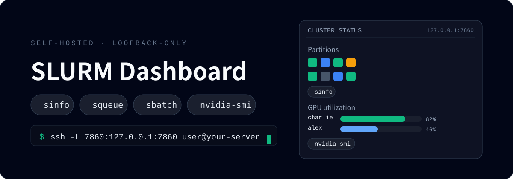
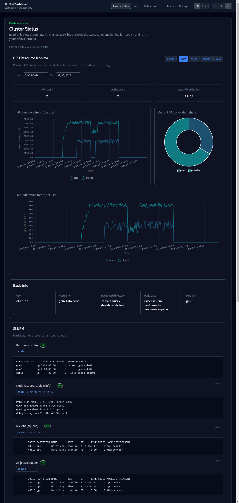

# SLURM 仪表盘

<p align="center">
  
</p>

[English README](README.md)

> 面向 SLURM 集群与 Linux 服务器初学者的自托管、只读为主的 Web 仪表盘。

<p align="center">
  
</p>

*Cluster Status：按用户的 GPU 使用历史、基础信息，以及每个区块背后的真实命令——squeue、sinfo、nvidia-smi。*

## 它能做什么

每个页面都标注了数据背后的**真实命令**并带复制按钮——你可以在自己的终端里逐一复现：

| 页面 | 展示内容 | 背后命令 |
|------|----------|----------|
| 集群状态 | 分区、你的队列**与全集群队列**、GPU、磁盘、内存 | `sinfo`、`squeue -u $USER`、`squeue`、`nvidia-smi`、`df -h`、`free -h` |
| GPU 监控 | 5 分钟粒度的资源历史，支持按日 / 周 / 月 / 年查看（线性或周期叠加视图） | `nvidia-smi`、`nvidia-smi --query-compute-apps` |
| 作业 | 活跃队列 + 仪表盘本地提交记录 | `squeue -u $USER`、本地 SQLite 记录 |
| 作业详情 | 会计记录 + 输出尾部 + 下载 | `sacct -j <id>`、`cat slurm-<id>.out` |
| 提交作业 | 粘贴 sbatch 脚本、从工作区选择脚本、或上传 `.sh` / `.sbatch` / `.py`（Python 脚本自动包装为 sbatch） | `sbatch --chdir=<workspace> ... run.sbatch` |
| 环境自检 | SLURM 工具链可用性 + 配置摘要 | 工具自身的版本 / 查询命令，例如 `sbatch --version`、`squeue --version`、`nvidia-smi --query-gpu=...`（页面会展示每个工具的实际命令） |

另有**命令速查表**（含 `tar | openssl` 加密 / 解密配方）和**首次运行设置向导**——只问一个问题：脚本和输出放在哪里？

## 为什么不一样

每个数据区块都标注了产生它的真实命令，并带复制按钮——界面本身就是一趟 `sinfo`、`squeue`、`sbatch`、`sacct`、`nvidia-smi` 的导览。

- **教学优先**：每个区块显示真实命令、处处可复制；速查表收录常用命令与 `tar | openssl` 加密配方。
- **双语界面**：英文与简体中文，导航栏按钮一键切换（`?lang=en|zh` 写入 cookie，刷新后保留）。未显式选择时，按浏览器语言（`Accept-Language`）或 `ui_lang` 配置（`en` / `zh` / `auto`）决定。
- **默认安全**：仅允许 loopback 绑定与 `Host` 校验、subprocess 一律使用 list 参数（无 shell 注入）、sbatch 参数白名单、文件路径边界检查、脚本输入大小限制，以及基础浏览器安全响应头。
- **轻量**：FastAPI + Jinja2 + SQLite，无 Node、无构建步骤。
- **深色主题**：浅色 / 深色 / 跟随系统切换。

## 快速开始

```bash
git clone https://github.com/Charlie-Wang-03/slurm-dashboard.git slurm-dashboard
cd slurm-dashboard
./install.sh                 # 创建 .venv 并安装依赖
./run_dashboard.sh           # 服务运行于 http://127.0.0.1:7860
```

服务仅绑定 `127.0.0.1`。想从笔记本访问时使用 SSH 端口转发：

```bash
ssh -L 7860:127.0.0.1:7860 user@你的服务器
# 然后在本地浏览器打开 http://127.0.0.1:7860
```

> **安全说明**。loopback 绑定可以阻止*远程*连接，应用也会拒绝非 loopback 的 HTTP `Host` 头（防 DNS rebinding）。但这**不能阻止同一主机上的其他本地用户**：项目没有身份认证，loopback 绑定、防火墙和带认证的反向代理都只能控制网络访问。请只在你信任全部本地用户的机器上运行（通常是自己的笔记本或单用户服务器）；在共享登录节点上，**没有任何配置能保护仪表盘免受其他本地用户访问**。浏览器的状态修改请求会做同源校验，页面也禁止被其他网站嵌入；`run_dashboard.sh` 与配置加载器都会拒绝非 loopback 的绑定地址——不要设法绕过。完整信任模型见 [SECURITY.md](SECURITY.md)。

首次访问会引导你选择工作区目录——这是唯一的设置步骤。

## 环境要求

- Linux + Python 3.10+（推荐 3.11）
- 真实提交作业需要 SLURM 客户端：`sbatch`、`squeue`、`sacct`、`scancel`、`sinfo`
- `sacct` 依赖集群的会计（accounting）配置：会计不可用时会计详情不可用，但仪表盘本地提交记录仍然可用。
- `nvidia-smi`（可选，用于 GPU 区块；历史采集器同样依赖它）
- 没有集群？仪表盘依然可以运行——状态区块会显示“命令不可用”，你仍可从速查表学习命令。

## 本项目不是什么

- **不是多用户 Web 服务**。没有任何身份认证或授权——任何能访问该端口的人（同一主机上的任何本地用户）都能看到仪表盘并以你的身份提交作业。
- **不是企业级 HPC 平台**。没有 LDAP / SSO、没有基于角色的访问控制、没有审计日志、没有 Web 终端。
- **不是 SLURM 的替代品**。它只以你自己的用户身份、在唯一的工作区目录中运行页面上展示的白名单命令。

## GPU 监控

GPU 图表由采集器驱动：每 5 分钟采样一次 `nvidia-smi`，追加到 `data/gpu_history/gpu_history.jsonl`（已被 git 忽略）。在 crontab 中添加一行即可持续积累历史数据：

```cron
*/5 * * * * cd /path/to/slurm-dashboard && .venv/bin/python tools/gpu_monitor.py >> logs/gpu_monitor.log 2>&1
```

不配置也不影响使用——GPU 区块在数据到来前显示空状态。历史文件会随采集持续增长；如关心磁盘空间请自行清理。仪表盘 API 在聚合前会限制 GPU 历史查询的日期跨度，避免异常请求在内存中生成无界时间桶。

### 采集器记录了哪些数据（隐私）

`tools/gpu_monitor.py` 每 5 分钟运行一次（通过你的 crontab），**只在本机记录**，追加写入 `data/gpu_history/gpu_history.jsonl`（已被 git 忽略，不应提交）：

- 每张 GPU 的利用率、显存、温度（`nvidia-smi`）；
- 每个使用 GPU 的进程：PID、进程名、显存占用、所属**用户名**（`ps`），以及若属于 SLURM 作业时的**作业 ID 与作业名**（`squeue` / `scontrol`）；
- CPU 利用率、负载均值与内存（`/proc`）。

这对你意味着：

- 运行时数据保留在服务器本机并被 git 排除。`scripts/check_privacy.sh` 在发布前扫描工作树与所有可达 Git 历史，CI 还会运行通用 secret 扫描。
- 仪表盘图表按**用户**展示 GPU 使用情况，因此在共享集群上，GPU 区块可能显示其他用户的用户名和作业名——这与终端里 `nvidia-smi` 显示的信息相同。在该集群上运行采集器前，请确认其使用政策。
- 历史文件会随采集持续增长（大小取决于 GPU 数量与使用它们的进程数量）；可随时删除，或移除 crontab 行以彻底停止采集。

## 配置

所有设置位于 `config.local.json`（已被 git 忽略）。完整键表见 [docs/architecture.md](docs/architecture.md#2-configuration-model)。常用键：

```jsonc
{
  "workspace_root": "",        // 空 = 未设置；首次运行向导会询问
                               // （预填 <repo>/workspace —— 脚本与
                               // 作业输出存放在这里）
  "slurm_partition": "",       // 空 = 不带 --partition 参数，
                               // 采用 SLURM 原生默认
  "allowed_partitions": [],    // 提交表单中的分区列表（可为空）
  "default_gres": "",          // 空 = 不带 --gres 参数，SLURM 默认
  "allowed_gres": [],
  "server_bind_host": "127.0.0.1",   // 仅接受 loopback 地址或 localhost
  "server_port": 7860,
  "ui_lang": "auto"            // auto | en | zh
}
```

一旦设置了分区或 GRES 值，它必须位于对应的白名单中——没有静默回退。通过 Web UI 粘贴、上传或从工作区选择的作业脚本最大为 1 MiB。

## 已验证范围与兼容性

- **自动化测试** —— 完整测试套件在 GitHub CI 上使用 Python 3.10、3.11 与 3.12 运行。
- **人工测试** —— 在一个真实 Linux + SLURM + NVIDIA GPU 环境完成：全新安装、首次启动向导、真实作业提交与输出、SSH 端口转发、Chrome 浏览器验收。
- **模拟降级** —— 无 SLURM / 无 GPU 路径在真实 HPC Linux 上通过进程级 `PATH` 隔离模拟验证。这是对无 SLURM 机器的模拟，并非在普通非 HPC Linux 主机上的完整测试。
- **不声称** —— 不声称兼容所有 Linux 发行版、所有 SLURM 版本或配置、所有集群会计配置、公网部署、多用户认证环境，或企业级保证。

完整的人工验收走查见 [docs/testing.md](docs/testing.md)。

## 开发

```bash
.venv/bin/python -m pytest tests/ -x -q        # 测试套件
.venv/bin/uvicorn app.main:app --host 127.0.0.1 --port 7861   # 开发实例
scripts/check_privacy.sh                       # 工作树 + 可达历史隐私门禁
```

CI 还会运行通用 secret 扫描与 Python 依赖漏洞审计。

- 架构与路由表：[docs/architecture.md](docs/architecture.md)
- 人工验收走查：[docs/testing.md](docs/testing.md)

## 升级

仪表盘把运行时状态存放在被 git 忽略的路径中（`config.local.json`、`data/`、`logs/`、`workspace/`、`.venv/`）。本项目不会跟踪这些路径，正常的快进更新预期会保留这些本地状态；升级前仍应备份重要的运行时数据。

仪表盘就是 `run_dashboard.sh` 启动的单个 `uvicorn` 进程。前台运行按 Ctrl-C 停止，或 `kill <pid>`；用 `./run_dashboard.sh` 重启。已提交给 SLURM 的作业**不受影响**——SLURM 会继续运行它们，停止的只是仪表盘。

升级步骤：

1. 停止仪表盘（见上文）。
2. 若你添加过 GPU 采集器的 crontab 行，请在依赖更新期间临时暂停它（在 `crontab -e` 中注释掉或暂时移除该行）。
3. `git pull --ff-only`
4. `./install.sh`
5. 若第 2 步暂停了采集器，恢复该 crontab 行。
6. 用 `./run_dashboard.sh` 启动。

这是安全的快进更新：

- 上述运行时路径是本项目有意不跟踪的本地状态。正常的 `git pull --ff-only` 预期会保留它们，但 ignored 文件本身不是备份；重要本地数据仍应单独留存副本。
- `git pull --ff-only` 在本地分支与上游分叉时会拒绝执行，绝不改写历史。若它失败，请自行检查情况（stash 或 rebase 本地改动），不要强制 reset。
- 位于仓库之外的工作区目录不会被 Git 或仪表盘删除或管理。

## 卸载

1. 停止仪表盘（见上文）。
2. 删除你克隆下来的仓库目录（内含 `.venv`、SQLite 数据库与采集到的 GPU 历史）：`rm -rf <仓库路径>`（例如 `rm -rf ~/slurm-dashboard`）。
3. 若添加过 crontab 行（`crontab -e` 中运行 `tools/gpu_monitor.py` 的那一行），请删除。
4. 已提交的作业会继续在集群上运行——如需取消请用 `scancel <作业ID>`。工作区目录默认在仓库内（`<repo>/workspace`）；若你选择了其他路径，请一并删除。

## 贡献

见 [CONTRIBUTING.md](CONTRIBUTING.md)。

## 许可证

MIT —— 见 [LICENSE](LICENSE)。随附第三方软件及其许可证见 [THIRD_PARTY_NOTICES.md](THIRD_PARTY_NOTICES.md)。安全说明与漏洞报告方式见 [SECURITY.md](SECURITY.md)。
